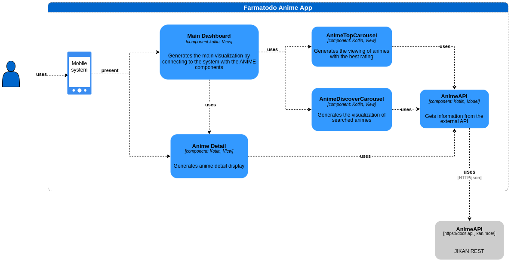

# SOLUCIÓN PROPUESTA PARA APP ANIME

# Descripción
Este proyecto está pensando para poder disponer de acuerdo a los requerimientos de dos visualizaciones:
* Dashboard: layout principal del app compuesta por tres segmentos:
    * Carrusel horizontal para la selección de animes mejor ranqueados en popularidad
    * carrusel vertical para la selección de animes organizadas por temporadas recientes
    * Buscador de animes por nombre de anime respuestá que sera cargada en en el carrusel Discover
* Detalle de anime: layout secundario en el que se vera en detalle especificaciones de un anime seleccionado desde el layour dashboard compuesto por tres segmentos
  * titulo del anime
  * etiquetas de verificación Al aire o Finalizada y duración 
  * banner del anime
  * ranking y origen del anime
  * score
  * sinapsis
  * botón para ver anime

# Descripción Técnica

## Diagrama de componente

Se genera la implementación mediante el uso de arquitectura **MVVM** que se explica en el siguiente diagrama del componente mobile

